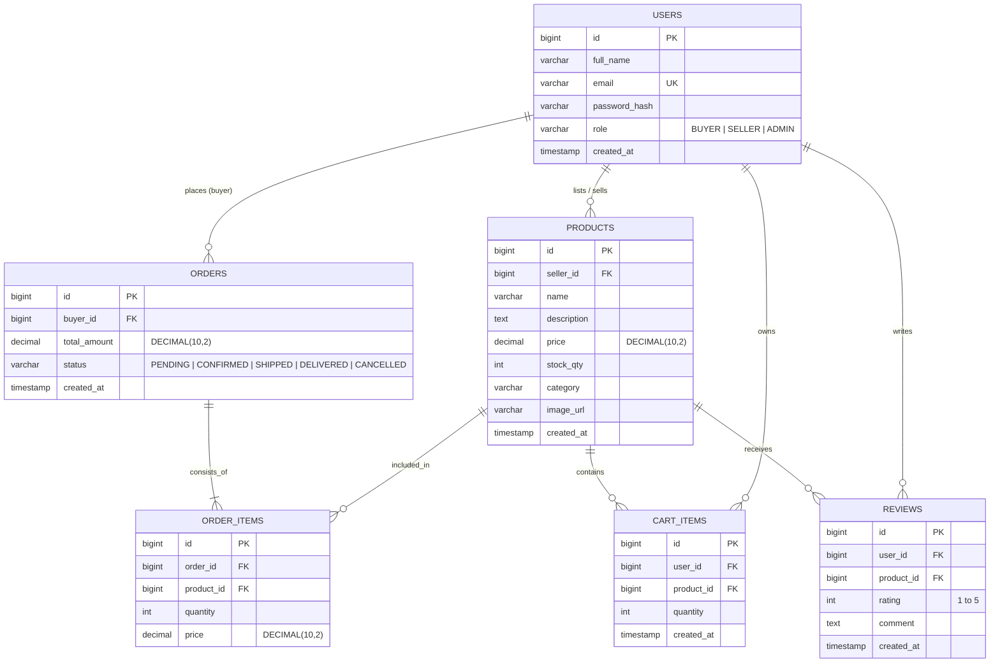
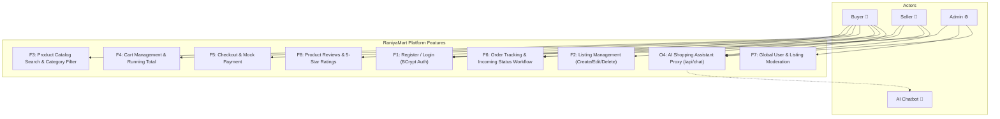
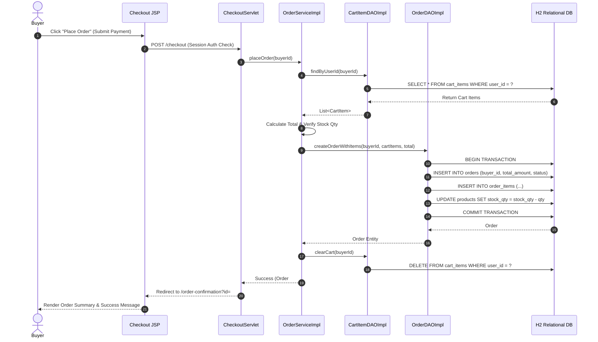

# RaniyaMart — Enterprise E-Commerce Platform & AI Assistant

[](https://www.oracle.com/java/)
[](https://tomcat.apache.org/)
[](https://github.com/Raniya08/RaniyaMart)
[](https://raniyamart.onrender.com)

**RaniyaMart** is an enterprise-grade multi-role e-commerce web application built using **Java Servlets**, **JDBC**, and **Apache Tomcat 9.0.x** for **Anna University R2025 (Semester 3)**.

- **Live Deployed Web Application**: [https://raniyamart.onrender.com](https://raniyamart.onrender.com)
- **Live Health Endpoint**: [https://raniyamart.onrender.com/api/v1/health](https://raniyamart.onrender.com/api/v1/health)
- **GitHub Repository**: [https://github.com/Raniya08/RaniyaMart.git](https://github.com/Raniya08/RaniyaMart.git)

---

## 🚀 Key Features

| ID | Feature | Description | Target Role | Status |
|---|---|---|---|---|
| **F1** | Authentication & AuthFilter | User Signup/Login with BCrypt password hashing, session timeout, and RBAC filter | Buyer, Seller, Admin | ✅ Complete |
| **F2** | Seller Listing Management | Create, Edit, Delete product listings with image URLs, category, and stock quantities | Seller | ✅ Complete |
| **F3** | Catalog Search & Filter | Multi-filter browsing by category, price sorting, and title search | Buyer | ✅ Complete |
| **F4** | Cart Management | Add/Update/Remove cart items with dynamic running totals | Buyer | ✅ Complete |
| **F5** | Transactional Checkout | Place orders from cart contents with mock payment confirmation step | Buyer | ✅ Complete |
| **F6** | Order Tracking & Workflow | Order history view for buyers; `Pending → Confirmed → Shipped → Delivered` status workflow for sellers | Buyer, Seller | ✅ Complete |
| **F7** | Admin Moderation | View all registered users and orders, moderate/remove product listings | Admin | ✅ Complete |
| **F8** | Product Reviews & Ratings | 5-star rating submission and review history on product detail pages | Buyer | ✅ Complete |
| **O4** | AI Shopping Assistant | Floating AI Chatbot widget (`chatbot.js`), `/api/chat` proxy with rate limiting, response caching, and Gemini/Mock fallback | All Users | ✅ Complete |

---

## 🛠️ Technology Stack

| Layer | Technology Used |
|---|---|
| **Language & Runtime** | Java 17 (JDK 17 LTS) |
| **Web Framework** | Java Servlets 4.0 (`javax.servlet.*`), JSP 2.3, JSTL 1.2 |
| **Application Server** | Apache Tomcat 9.0.x / Embedded Jetty |
| **Database & Pooling** | Embedded Persistent H2 Database (`./data/raniyamartdb.mv.db`), HikariCP Connection Pool |
| **Security** | BCrypt (`jBCrypt 0.4`), HTTPS Session Management, `AuthFilter` |
| **AI Engine** | Google Gemini 1.5 Flash REST API + Offline Canned Domain FAQ (`MockChatProvider`) |
| **Build & Test** | Apache Maven 3.8+, JUnit 5, Mockito |
| **Cloud Deployment** | Render.com PaaS Container Deployment |

---

## 📐 System Architecture & Diagrams

### 1. D1 Entity-Relationship (ER) Diagram


---

### 2. D2 Use Case Diagram


---

### 3. D3 Sequence Diagram: Place Order Flow


---

## 🏃 Quick Start Local Setup

```bash
# 1. Clone repo
git clone https://github.com/Raniya08/RaniyaMart.git
cd RaniyaMart

# 2. Run automated JUnit tests
mvn clean verify

# 3. Launch application locally on http://localhost:8080
mvn jetty:run
```

---

## 🔑 Demo Account Credentials

- **Admin Account**: `admin@raniyamart.com` | Password: `Password123!`
- **Seller Account**: `seller@raniyamart.com` | Password: `Password123!`
- **Buyer Account**: `buyer@raniyamart.com` | Password: `Password123!`

---

## 📁 Key Project Documents

- 📄 [CONTRIBUTING.md](file:///C:/Users/Hi/RaniyaMart/CONTRIBUTING.md) — Local development & setup guide
- 📜 [RETRO.md](file:///C:/Users/Hi/RaniyaMart/RETRO.md) — Sprint retrospectives (Weeks 1 – 11)
- 📊 [docs/FINAL_REPORT.md](file:///C:/Users/Hi/RaniyaMart/docs/FINAL_REPORT.md) — Comprehensive capstone report
- 🖥️ [docs/PRESENTATION_SLIDES.md](file:///C:/Users/Hi/RaniyaMart/docs/PRESENTATION_SLIDES.md) — Final review slide deck
