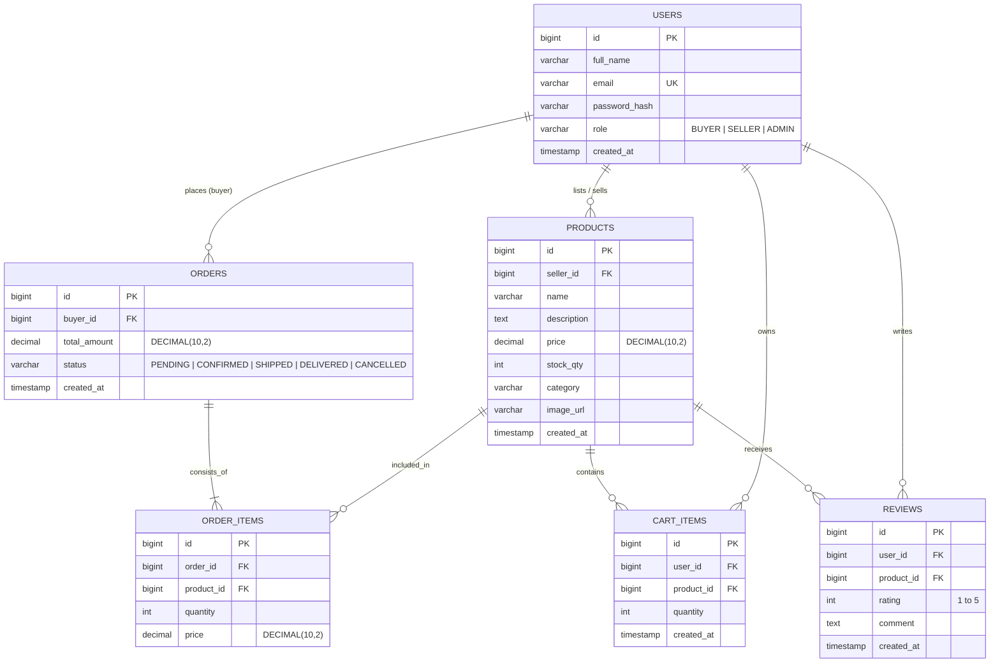
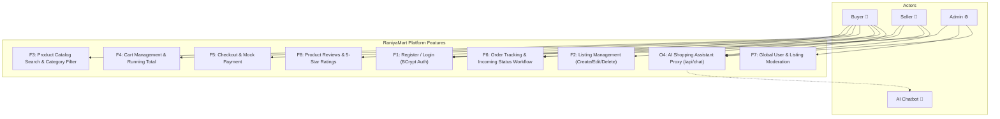
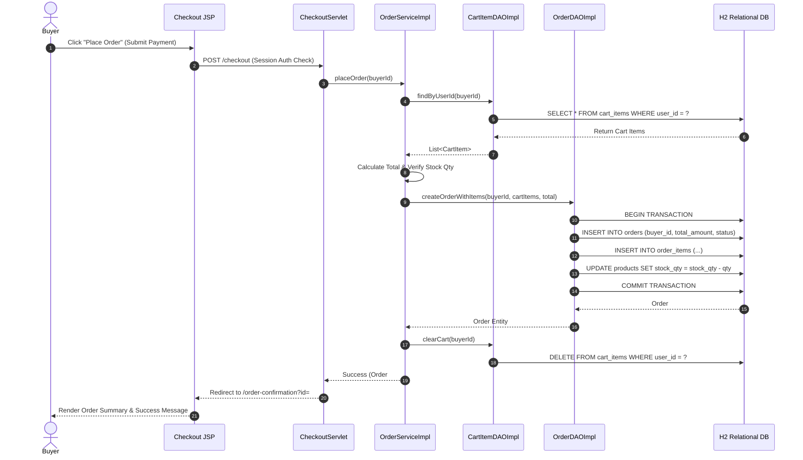

# RaniyaMart Capstone Project — Final Technical Report
**Course**: Java Servlets · JDBC · Apache Tomcat — Anna University R2025 (Semester 3)  
**Project Name**: RaniyaMart  
**Package Name**: `com.raniya.raniyamart`  
**Live Deployment URL**: [https://raniyamart.onrender.com](https://raniyamart.onrender.com)  
**GitHub Repository**: [https://github.com/Raniya08/RaniyaMart.git](https://github.com/Raniya08/RaniyaMart.git)

---

##  EXECUTIVE SUMMARY

RaniyaMart is an enterprise-grade multi-role e-commerce web application engineered with pure Java Servlets (JAX-RS spec), JDBC, and Apache Tomcat 9.0.x. Designed around strict architectural layering, it provides end-to-end shopping capabilities for **Buyers**, listing management and order processing for **Sellers**, system-wide moderation for **Administrators**, and an intelligent **AI Chatbot Assistant** for real-time customer assistance.

All product prices are displayed in Indian Rupees (₹), and all data persists cleanly in an embedded file-backed H2 relational database (`./data/raniyamartdb.mv.db`).

---

## 📐 ARCHITECTURE & SYSTEM DESIGN

### System Layering Architecture
RaniyaMart follows a strict 4-tier MVC architecture:
1. **Presentation Layer (View)**: Modular JSP templates enhanced with JSTL `<c:out>` escaping, CSS3 custom properties, and asynchronous JavaScript widgets (`chatbot.js`, `app.js`).
2. **Controller Layer (Front Controller)**: Lightweight `HttpServlet` controllers (`ProductServlet`, `CartServlet`, `OrderServlet`, `AdminServlet`, `ChatServlet`) mapped via `@WebServlet` annotations.
3. **Service Layer (Business Logic)**: Enterprise services (`UserService`, `ProductService`, `CartService`, `OrderService`, `ReviewService`, `ChatProvider`) encapsulating input validation, domain rules, and transactional workflows.
4. **Data Access Layer (DAO)**: Pure JDBC implementations (`UserDAOImpl`, `ProductDAOImpl`, `OrderDAOImpl`, `CartItemDAOImpl`, `ReviewDAOImpl`) utilizing `PreparedStatement` and HikariCP connection pooling.

---

## 📊 DIAGRAMS

### 1. D1 Entity-Relationship (ER) Diagram

---

### 2. D2 Use Case Diagram

---

### 3. D3 Sequence Diagram: Place Order Flow

---

## 🛠️ DESIGN PATTERNS IMPLEMENTED

1. **DAO (Data Access Object) Pattern**: Decouples persistent database code (`UserDAOImpl`, `ProductDAOImpl`, `OrderDAOImpl`) from higher-level business services (`UserService`, `ProductService`).
2. **Front Controller Pattern**: `HttpServlet` instances (`ProductServlet`, `CartServlet`, `OrderServlet`, `AdminServlet`) act as centralized request dispatchers.
3. **Singleton Pattern**: Managed connection pool instance owned by `DBConnectionListener` and `ChatProviderFactory`.
4. **Factory Pattern**: `ChatProviderFactory` instantiates appropriate `ChatProvider` implementations (`MockChatProvider` vs `GeminiChatProvider`) dynamically based on runtime properties.
5. **Strategy Pattern**: `ChatProvider` interface allows swapping between canned offline FAQ logic and live external LLM API calls without altering controller handlers.
6. **Builder Pattern**: Constructing complex DTOs (`UserResponseDTO`, `UserRegisterDTO`, `ApiResponse`) cleanly.

---

## 🔒 SECURITY HARDENING CHECKLIST VERIFICATION

- ✅ **PreparedStatement Everywhere**: 100% of SQL operations utilize parameterized `PreparedStatement` parameters.
- ✅ **BCrypt Password Hashing**: Passwords stored as one-way salted BCrypt hashes (`$2a$10$...`).
- ✅ **Session Hijacking Protection**: Session invalidated and regenerated on successful login.
- ✅ **Role-Based Access Control (RBAC)**: `AuthFilter` protects `/seller/*` and `/admin/*` routes.
- ✅ **XSS Prevention**: Dynamic JSP text rendered with JSTL `<c:out>` and `fn:escapeXml`.
- ✅ **Excluded Credentials**: `config.properties` and `.env` excluded via `.gitignore`.
- ✅ **Error Handling**: Custom error pages (`404.jsp`, `500.jsp`) prevent stack trace exposure.

---

## ⚠️ KNOWN LIMITATIONS

1. **Payment Gateway Integration**: Payment processing currently executes via a simulated mock step rather than a live credit card payment gateway.
2. **H2 File Mode Locking**: H2 running in file mode requires single-process locking (`AUTO_SERVER=TRUE` enabled to allow concurrent administration).
